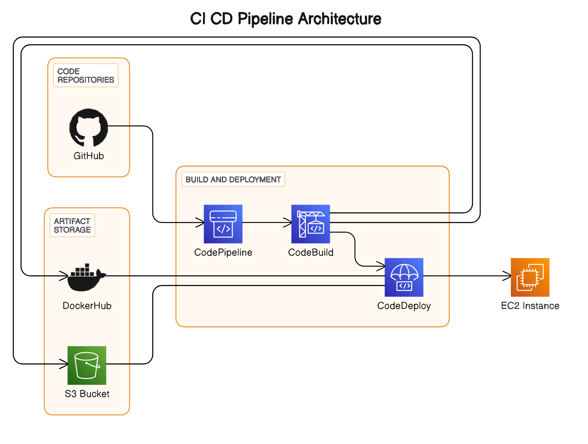

# CI/CD Pipeline Setup Guide 🚀

## CICD diagrams


## Overview
This guide will walk you through setting up a Continuous Integration/Continuous Deployment (CI/CD) pipeline using AWS services for a Python Flask web application hosted on GitHub. The pipeline will automatically build and deploy the application to AWS EC2 instances via AWS CodeDeploy whenever changes are made to branches matching the pattern `digit.digit-rc`.

## Prerequisites
- AWS account with necessary permissions.
- GitHub repository with the Python Flask web application.

## Project Structure
Your project structure should look like this:


```css
your-repo/
│
├── app/
│   ├── [Your Flask application files]
│
├── scripts/
│   ├── [Your deployment scripts]
│
├── code_build_src/
│   ├── version.txt
│   ├── [Other files generated during build]
│
├── appspec.yml
└── buildspec.yml
```

## Steps

### 1. Configure AWS CodePipeline
- 🛠️ Go to the AWS Management Console and navigate to CodePipeline.
- 🏗️ Create a new pipeline.
- 📦 Configure the source provider as GitHub and select your repository.
- 🛠️ Configure the build stage using the provided `buildspec.yml`.
- 🚀 Configure the deploy stage using the provided `appspec.yml`.

### 2. IAM Role Configuration
- 🤝 Create an IAM role with permissions required for CodePipeline, CodeBuild, and CodeDeploy.
- 📜 Attach the IAM role to your pipeline and EC2 instances.

### 3. Testing
- 🧪 Make a test commit to a branch matching the pattern `digit.digit-rc` to trigger the pipeline.
- ✅ Ensure the pipeline completes successfully and the changes are deployed to your EC2 instances.

## Usage
- Clone this repository to your local machine.
- Configure the AWS CodePipeline with your GitHub repository.
- Modify the `appspec.yml` and `buildspec.yml` files if necessary.
- Run tests to ensure the pipeline works as expected.

## Conclusion
Congratulations! You have successfully set up a CI/CD pipeline for your Python Flask web application using AWS services. Now, every time changes are made to the specified branches, your application will be automatically built, versioned, and deployed to your EC2 instances. 🎉

Feel free to customize and expand upon this guide based on your specific requirements and preferences.
